# Лабораторне заняття №1: Ознайомлення з TypeScript

## Мета роботи
Ознайомитися з основами мови TypeScript шляхом виконання практичних завдань, що демонструють базові можливості мови: типізацію, інтерфейси, класи, композитні типи та дженерики.

---
## Завдання 1: Типізація змінних

**Опис:**  
Оголошено змінні типів `string`, `number`, `boolean`, `array`, `object`.  
Створено функцію, яка приймає об'єкт `{ name: string, age: number }` і повертає форматований рядок.

**Скріншоти: Завдання 1: Типізація змінних**

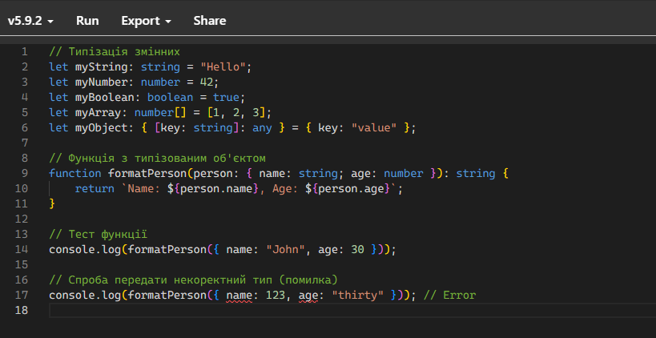

**Результат .JS:**

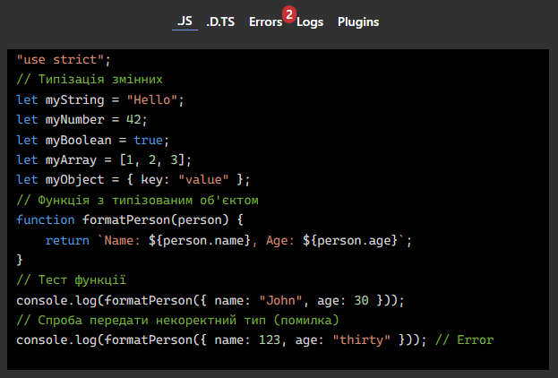

**Результат .D.TS:**

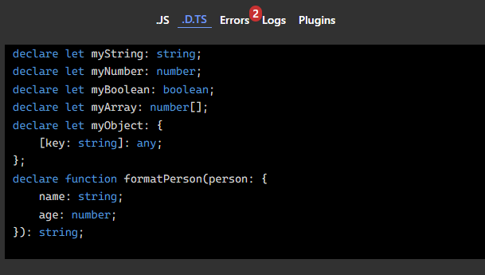

**Результат Errors:**

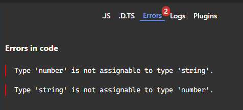

**Результат Logs:**

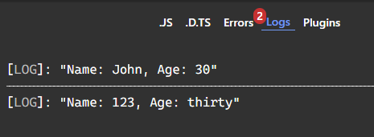

## Завдання 2: Інтерфейси

**Опис:** 
Створено інтерфейс Person з опціональним полем address.
Реалізовано функцію printPerson, яка виводить дані об'єкта у консоль.

**Скріншоти: Завдання 2: Інтерфейси**

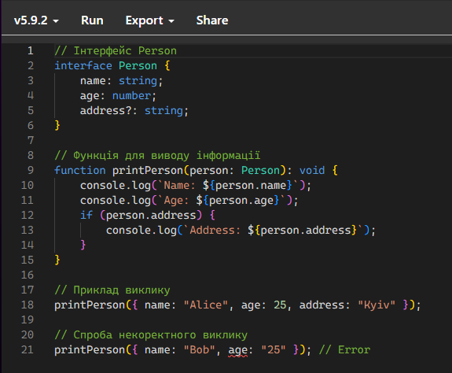

**Результат .JS:**

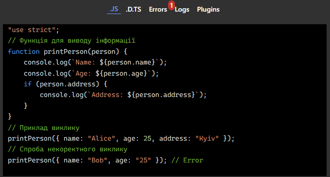

**Результат .D.TS:**

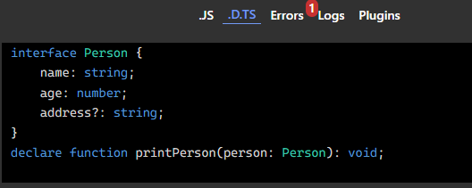

**Результат Errors:**

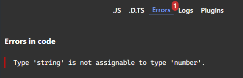

**Результат Logs:**

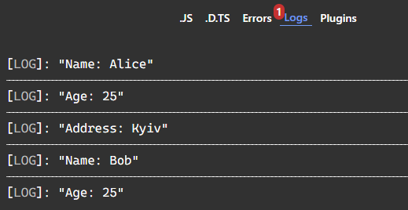

## Завдання 3: Композитні типи (Union type)

**Опис:** 
Оголошено тип Status = 'success' | 'error' | 'loading'.
Функція showStatus виводить повідомлення залежно від значення статусу.

**Скріншоти: Завдання 3: Композитні типи (Union type)**

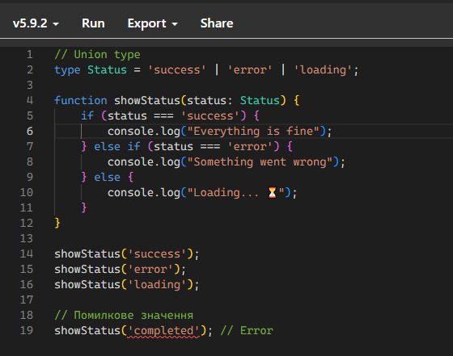

**Результат .JS:**

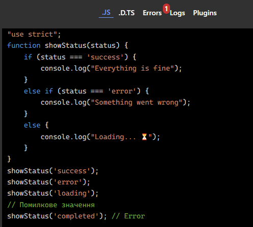

**Результат .D.TS:**

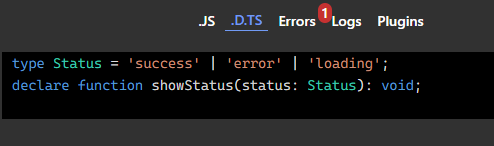

**Результат Errors:**

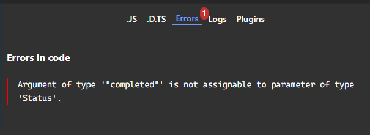

**Результат Logs:**

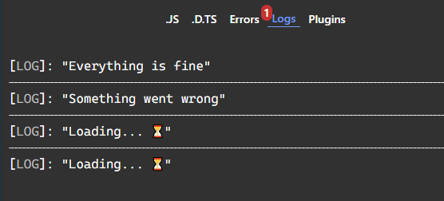

## Завдання 4: Дженерики

**Опис:** 
Створено універсальну функцію identity<T>, яка повертає значення типу T.
Продемонстровано використання з типами number, string, boolean.

**Скріншоти: Завдання 4: Дженерики**

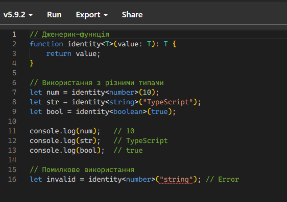

**Результат .JS:**

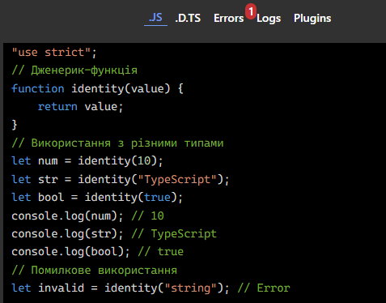

**Результат .D.TS:**

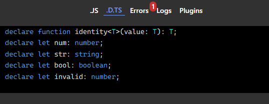

**Результат Errors:**

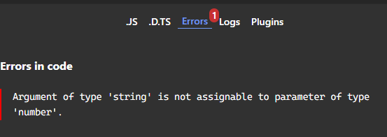

**Результат Logs:**

## Завдання 5: Класи

**Опис:** 
Оголошено клас Car з полями model та year, а також методом getCarInfo().

**Скріншоти: Завдання 5: Класи**

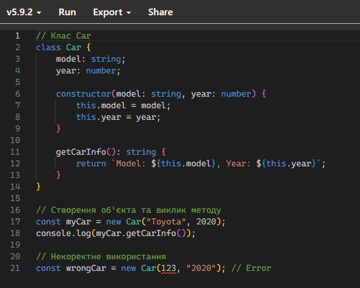

**Результат .JS:**

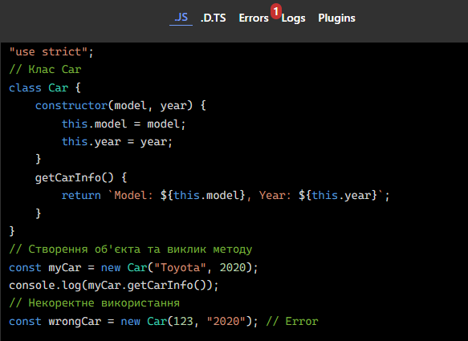

**Результат .D.TS:**

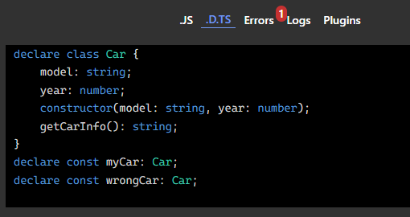

**Результат Errors:**

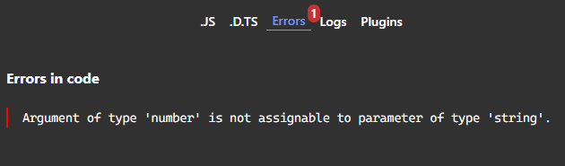

**Результат Logs:**

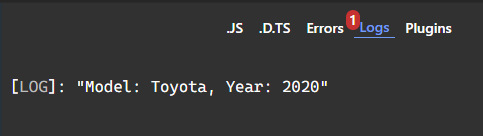

## Дослідження помилок
У кожному завданні тестувалась типова помилка: передача неправильного типу даних.
TypeScript Playground правильно виявляє помилки та відображає їх у вкладці Errors.

**Приклад помилки:**

printPerson({ name: "Bob", age: "25" }); // age очікується як number, а передано string

